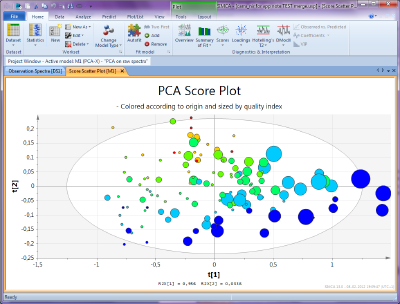

#Multivariate analysis cookbook

This is a cookbook for handling multivariate analysis using SIMCA. 

By following the steps in this cookbook with the excel sheet found [here](https:/someting)

1.	First start simca 
2.	Load your excel file by doing clicking like in the figure  
	
3.	Set something  
	
4.	Set something else  
	
	
 		