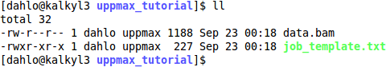
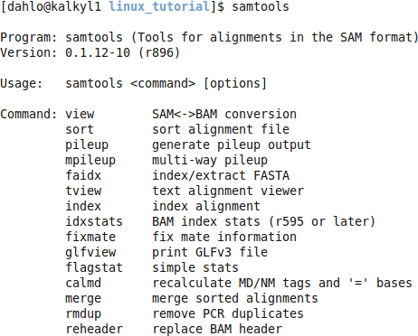

# UPPMAX Introduction
**NOTE:** in syntax examples, the dollar sign ($) is not to be printed. The dollar sign is usually an indicator that the text following it should be typed in a terminal window.

## 1. Connecting to UPPMAX
The first step of this lab is to open a ssh connection to UPPMAX. You will need a ssh program to do this:

On Linux: it is included by default, named **Terminal**.

On OSX: it is included by default, named **Terminal**.

On Windows: [Google MobaXterm](http://bit.ly/19yaQOM) and download it.

Fire up the available ssh program and enter the following (replace **username** with your uppmax user name). -X means that X-forwarding is activated on the connection, which means graphical data can be transmitted if a program requests it, i.e. programs can use a graphical user interface (GUI) if they want to.

```bash
$ ssh -X username@milou.uppmax.uu.se
```

and give your password when prompted. As you type, nothing will show on screen. No stars, no dots. It is supposed to be that way. Just type the password and press enter, it will be fine.

Now your screen should look something like this:


## 2. Getting a node of your own (only if you canceled your job before lunch)
Usually you would do most of the work in this lab directly on one of the login nodes at uppmax, but we have arranged for you to have one core each to avoid disturbances. This was covered briefly in the lecture notes.

<font color='red'>Check with squeue -u username if you still have your reservation since before lunch running. If it is running, skip this step and connect to that reservation.</font>

(We only have 20 reserved cores, so if someone has two, someone else will not get one..)

```bash
$ salloc -A g2015006 -t 04:30:00 -p core -n 1 --no-shell --reservation=g2015006_19 &
```

check which node you got (replace **username** with your uppmax user name)

```bash
$ squeue -u username
```

should look something like this


where **q34** is the name of the node I got (yours will probably be different). Note the numbers in the Time column. They show for how long the job has been running. When it reaches the time limit you requested (4.5 hours in this case) the session will shut down, and you will lose all unsaved data. Connect to this node from within uppmax.

```bash
$ ssh -X q34
```

**Note:** there is a uppmax specific tool called jobinfo that supplies the same kind of information as squeue that you can use as well (```$ jobinfo -u username```).

## 3. Copying files needed for laboratory
To be able to do parts of this lab, you will need some files. To avoid all the course participants editing the same file all at once, undoing each other's edits, each participant will get their own copy of the needed files. The files are located in the folder **/proj/g2015006/labs/uppmax_tutorial**

Next, copy the lab files from this folder. -r means recursively, which means all the files including sub-folders of the source folder. Without it, only files directly in the source folder would be copied, NOT sub-folders and files in sub-folders.

**NOTE: Remember to tab-complete to avoid typos and too much writing.**

Ex.

```bash
$ cp -r <source> <destination>

$ cp -r /proj/g2015006/labs/uppmax_tutorial ~/glob/ngs-intro/
```

Have a look in **~/glob/ngs-intro/uppmax_tutorial**:

```bash
$ cd ~/glob/ngs-intro/uppmax_tutorial

$ ll
```



## 4. Running a program
Among the files that were copied is data.bam. Bam is a popular format to store aligned sequence data, but since it is a, so called, binary format it doesn't look that good if you are human. Try it using less:

```bash
$ less data.bam
```


Not so pretty.. Luckily for us, there is a program called **samtools** (http://sourceforge.net/apps/mediawiki/samtools/index.php?title=SAM_FAQ) that is made for reading bam files.

To use it on uppmax we must first load the module for **samtools**. Try starting samtools before loading the module:

```bash
$ samtools
```


That did not work, try it again after loading the module:

```bash
$ module load bioinfo-tools samtools
$ samtools
```

**NOTE: All modules are unloaded when you disconnect from UPPMAX, so you will have to load the modules again every time you log in. If you load a module in a terminal window, it will not affect the modules you have loaded in another terminal window, even if both terminals are connected to UPPMAX. Each terminal is independent of the others.**



To use samtools to view a bam file, use the following line:

```bash
$ samtools view -h data.bam
```


**-h** also print the bam file's **header**, which is the rows starting with **@ signs** in the beginning of the file. These lines contain so called **metadata**; information about the data stored in the file. It contain things like which program was used to generate the bam file and which chromosomes are present in the file. Try running the command without the **-h** to see the difference.

The not-binary version (ASCII, or text version) of a bam file is called a **sam file**, which was just printed directly into the terminal window. The sam file is not to much use for us printed in the terminal window, aesthetics aside. It is probably much better to have the sam file saved as an actual file, something that is very easy to do. Any text that is printed to the terminal can be saved to a file instead of the terminal window using a 'crocodile mouth', **>**

Ex.

```bash
$ programname arguments > outfile
```

which will launch a program named **programname**, supply it with the argument **argumets**, and write any output that would have been printed to the screen to the file **outfile** instead.

To use this on samtools:

```bash
$ samtools view -h data.bam > data.sam
```

Look at the created file:

```bash
$ ll
```

The sam file is now human readable. Try viewing it with **less**:

```bash
$ less data.sam
```

You can also edit the file with **nano**:

```bash
$ nano data.sam
```

Try deleting the whole last line in the file, save it, and exit nano.

## 5. Modules
To view which module you have loaded at the moment, type

```bash
$ module list
```


Let's say that you want to make sure you are using the latest version samtools. Look at which version you have loaded at the moment (samtools/0.1.12-10).

Now type 

```bash
$ module avail
```

to see which programs are available at UPPMAX. Can you find samtools in the list? Which is the latest version of samtools available at UPPMAX?

To change which samtools module you have loaded, you have to unload the the module you have loaded and then load the other module. To unload a module, use

```bash
$ module unload <module name>

```

Look in the list from ```$ module list``` to see the name of the module you want to unload.

When the old module is unloaded, load the latest samtools module (samtools/0.1.18).

## 6. Submitting a job
Not all jobs are as small as converting this tiny bam file to a sam file. Usually the bam files are several gigabytes, and can take hours to convert to sam files. You will not have reserved nodes waiting for you to do something either, so running programs is done by submitting a job to the queue system. What you submit to the queue system is a script file that will be executed as soon as it reaches the front of the queue. The scripting language used in these scripts is **bash**, which is the same language as you usually use in a terminal i.e. everything so far in the lecture and lab has been in the bash language (cd, ls, cp, mv, etc.).

Have a look at **job_template.txt** in your **uppmax_tutorial** folder.

```bash
$ less job_template.txt
```


Edit this file to make the job convert **data.bam** to a sam file named **jobData.sam**. Remember how the queue works? Try to approximate the runtime of the job (almost instant in this case) and increase it by ~50%, and use that time approximation when writing your script file. Longer jobs will wait longer in the queue because it is harder to fit them into gaps in the queue! Also remember to change the project ID to match this course occation.

Remember, just write the command you would run if you were sitting by the computer, i.e. load the correct modules, go to the correct folder, and run samtools the right way.

Submit your job using sbatch:

```bash
$ sbatch job_template.txt
```

## 7. Viewing the queue
If you want to know how your jobs are doing in the queue, you can check their status with ```$ squeue -u username``` or ```$ jobinfo -u username```.

Rewrite the previous sbatch file so that you book 3 days of time, and to use a node instead of a core. This will cause your job to stand in the queue for a bit longer, so that we can have a look at it while it is queuing. Submit it to the queue and run **jobinfo**.

```bash
$ jobinfo -u <username>
```


If you look under the heading **"Waiting jobs:"** you'll see a list of all the jobs you have in the queue that have not started yet. The most interesting column here is the **POS** column, which tells you which position in the queue you have (12 in my example). When you reach the first place, your job will start as soon as there are the resources you have asked for.

In our case, we are not really interested in running this job at all. Let's cancel it instead. This can be done with the command **scancel**. Syntax:

```bash
$ scancel <job id>
```

You see the job id number in the output from jobinfo or squeue.

```bash
$ scancel 2226987
```

8. Interactive
Sometimes it is more convenient to work interactively on a node instead of submitting your work as a job. Since you will not have the reservations we have during the course, you will have to book a node using the **interactive** command. Syntax:

```bash
$ interactive -A <project id> -t <time> -p <node or core>
```

This will create a booking for you which has a higher priority than the jobs submitted with sbatch. That means that they will start faster, but only if the booking is shorter than 12 hours. If the booking is longer than 12 hours, it will get the standard priority. When the job starts you will be transferred to the node you got automatically. No need to look which node you got using sbatch and then ssh:ing to it.

Try closing down your current session on the reserved node you connected to in the beginning of the lab by typing exit. Then make a new booking using interactive:

```bash
$ interactive -A g2015006 -t 02:00:00 -p core
```

Congratulations, you are now ready to be let loose on the cluster!

## 9. Extra, if you finish too fast
### The devel queue
If it is a really big job, it might be in the queue for a day or two before it starts, so it is important to know that the first thing it does is not crashing because you made a typo on line 7. One way to test this is to open a new connection to uppmax, and line by line try your code. Copy-paste (ctrl+shift+c and ctrl+shift+v in the terminal window) to make sure it's really the code in the script you are trying.

If your script is longer than a couple of lines, this approach can be tiring. There are 12 nodes at uppmax that are dedicated to do quick test runs, which have a separate queue called **devel**. They are available for use more or less all the time since not very many are using them. To avoid people abusing the free nodes for their analysis, there is a **1 hour time limit** for jobs on them. To submit jobs to this short testing queue, change -p to devel instead of node or core, and make sure -t is set to **maximum 01:00:00**. Try submitting the samtools sbatch file we used earlier to the devel queue and run it again.

### Information about finished jobs
If you want information about jobs you have run in the past, you can use the tool **finishedjobinfo**. It will print information about the jobs you have run lately.

Fun things to look for in this information is **jobstate** which will tell you if the program reported any error while running. If so, jobstate will be **FAILED** and you could suspect that something didn't go according to the plan, and you should check the output from that job run (the slurm-.out file) and see if you can solve the error.

Other good things to look for could be:

* **maxmemory_in_GiB**: tells you how much memory the program used at most.
* **runtime**: tells you how long time the program ran before it finished/failed

### Time and space
Remember the commands **uquota** (show how much of your storage space you are using) and **projinfo** (shows you how much of your allocated time you have used) from the lecture? Try running them and see how you are doing.

For the fast ones: [Uppmax pipeline exercise](uppmax-pipeline) - This optional material will teach you the basics in creating pipelines. Continue with this if you finish the current lab ahead of time, or whenever you want.